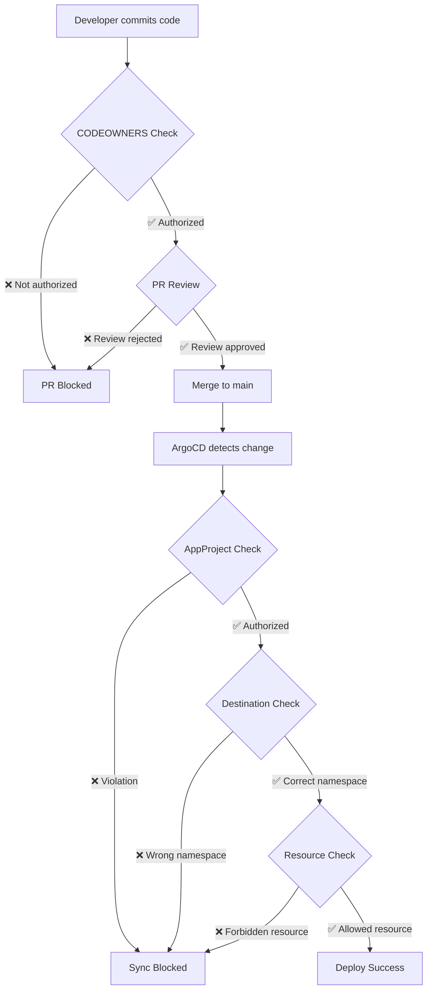

# Structure Complète des Repositories GitOps

## 1. Architecture Globale des Repositories

### Vue d'Ensemble
```
REPOSITORIES CODE SOURCE (Séparés par équipe)
├── team-alpha-ecommerce-frontend/     # Code source Team Alpha
├── team-alpha-ecommerce-backend/      # Code source Team Alpha  
├── team-beta-billing-service/         # Code source Team Beta
├── team-beta-payment-gateway/         # Code source Team Beta
└── devops-infrastructure-code/        # Code Terraform/Ansible DevOps

REPOSITORY GITOPS UNIQUE (Partagé mais contrôlé)
└── company-gitops-repo/               # Manifests K8s de TOUTES les équipes
```

## 2. Stratégies de Gestion Possible

### Option A: Repository GitOps Unique avec Contrôle d'Accès (RECOMMANDÉ)

```
company-gitops-repo/  (Repository unique, accès contrôlé par dossiers)
├── infrastructure/                    # DevOps: Write, Others: Read
│   ├── base/
│   │   ├── ingress-controller.yaml
│   │   ├── cert-manager.yaml
│   │   └── monitoring.yaml
│   └── overlays/
│       ├── dev/
│       ├── staging/
│       └── prod/
├── applications/
│   ├── team-alpha/                    # Team Alpha: Write, Others: Read
│   │   ├── ecommerce-frontend/
│   │   │   ├── base/
│   │   │   │   ├── deployment.yaml
│   │   │   │   ├── service.yaml
│   │   │   │   └── kustomization.yaml
│   │   │   └── overlays/
│   │   │       ├── dev/
│   │   │       ├── staging/
│   │   │       └── prod/
│   │   └── ecommerce-backend/
│   │       └── ...
│   └── team-beta/                     # Team Beta: Write, Others: Read
│       ├── billing-service/
│       └── payment-gateway/
├── argocd-config/                     # DevOps: Write, Others: Read
│   ├── projects/
│   │   ├── infra-project.yaml
│   │   ├── team-alpha-project.yaml
│   │   └── team-beta-project.yaml
│   └── applications/
│       ├── infra-apps/
│       ├── team-alpha-apps/
│       └── team-beta-apps/
└── shared-services/                   # Cloud + DevOps: Write, Others: Read
    ├── monitoring/
    ├── security/
    └── networking/
```

#### Permissions GitHub/GitLab sur company-gitops-repo:
```yaml
Repository: company-gitops-repo
├── Branch protection: main (require PR + reviews)
├── CODEOWNERS file:
│   ├── /infrastructure/               @devops-team
│   ├── /applications/team-alpha/      @team-alpha-leads @devops-team  
│   ├── /applications/team-beta/       @team-beta-leads @devops-team
│   ├── /argocd-config/               @devops-team
│   └── /shared-services/             @cloud-team @devops-team
└── Team Permissions:
    ├── DevOps: Admin (peut merger partout)
    ├── Team Alpha: Write (peut créer PR sur /applications/team-alpha/)
    ├── Team Beta: Write (peut créer PR sur /applications/team-beta/) 
    ├── Cloud: Write (peut créer PR sur /shared-services/)
    └── Managers: Read (lecture seule)
```

pour le colloquio je peut prendre cette exemple :

ce repos unique comporte les repos pour les equipe infra(devops) et dev (team alpha et beta)
la ou on voit devops write et other : Read  signifie que les devops peuvent ecrire et c est controller sur git ou sur gitlab on fonction ou
le repos se trouve la persone qui creer le project gitops creer aussi les permissions pour chaque equipe 

- le role des project et app argocd c est au niveau du deployement : gere les restriction sur qui peut deployer koi et dans quel infra ou namespace
exple : de mon project avec 40 microservice a deployer : mon repos gitops sera constituer de differents repos par equipe comme on peut le voir ci decu
et si la team alpha travaille sur 10 microservice on aura un project qui vas delimiter ce que la team alpha peut deployer et 10 * 3 applications pour deployer chaque microservice par env


# Contrôle d'Accès ArgoCD - Projects vs Repository

## ⚠️ CLARIFICATION IMPORTANTE

**Les ArgoCD Projects NE contrôlent PAS qui peut lire/écrire les fichiers dans le repository Git !**

Les commentaires `# DevOps: Write, Others: Read` dans la structure étaient trompeurs. Voici la vraie explication :

## 1. Séparation des Responsabilités

### Repository Git (GitHub/GitLab) 
```
company-gitops-repo/
├── infrastructure/                    # ← Permissions GIT contrôlent l'écriture
│   ├── base/
│   └── overlays/
└── applications/
    ├── team-alpha/                    # ← Permissions GIT contrôlent l'écriture  
    └── team-beta/                     # ← Permissions GIT contrôlent l'écriture
```

**Contrôlé par :**
- GitHub/GitLab permissions
- CODEOWNERS file
- Branch protection rules
- Team permissions

### ArgoCD Projects
```yaml
# Contrôle ce qui peut être DÉPLOYÉ, pas ce qui peut être MODIFIÉ dans Git
apiVersion: argoproj.io/v1alpha1
kind: AppProject
spec:
  sourceRepos:           # ← Quels repos peuvent être utilisés
  destinations:          # ← Où peut être déployé  
  clusterResourceWhitelist: # ← Quelles ressources K8s autorisées
  roles:                # ← Qui peut déclencher sync/rollback dans ArgoCD UI
```

## 2. Comment Fonctionne le Contrôle d'Accès Réel

### Étape 1: Permissions Repository (GitHub/GitLab)

#### CODEOWNERS File
```bash
# Dans company-gitops-repo/.github/CODEOWNERS

# Infrastructure - Seuls DevOps peuvent modifier
/infrastructure/                    @devops-team
/argocd-config/                     @devops-team
/shared-services/                   @devops-team @cloud-team

# Applications Team Alpha - Team Alpha + DevOps review
/applications/team-alpha/           @team-alpha-leads @devops-team

# Applications Team Beta - Team Beta + DevOps review  
/applications/team-beta/            @team-beta-leads @devops-team
```

#### Permissions GitHub/GitLab
```yaml
Repository: company-gitops-repo
├── Branch: main (protected)
│   ├── Require pull request reviews: ✅
│   ├── Dismiss stale reviews: ✅ 
│   └── Require review from code owners: ✅
├── Team Permissions:
│   ├── devops-team: Admin
│   ├── team-alpha-developers: Write (mais limité par CODEOWNERS)
│   ├── team-beta-developers: Write (mais limité par CODEOWNERS)
│   └── managers: Read
```

### Étape 2: ArgoCD Projects (Contrôle de Déploiement)

#### Project Infrastructure (DevOps)
```yaml
apiVersion: argoproj.io/v1alpha1
kind: AppProject
metadata:
  name: infra-project
spec:
  # Peut utiliser n'importe quel repo
  sourceRepos: ['*']
  
  # Peut déployer partout
  destinations:
  - server: '*'
    namespace: '*'
    
  # Peut créer toutes ressources
  clusterResourceWhitelist:
  - group: '*'
    kind: '*'
    
  roles:
  - name: devops-admin
    policies:
    - p, proj:infra-project:devops-admin, applications, *, infra-project/*, allow
    groups:
    - devops-team
```

#### Project Team Alpha (Développeurs)
```yaml
apiVersion: argoproj.io/v1alpha1
kind: AppProject  
metadata:
  name: team-alpha-project
spec:
  # RESTRICTION: Seul repo GitOps autorisé
  sourceRepos:
  - 'https://github.com/company/company-gitops-repo'
  
  # RESTRICTION: Seulement namespaces team-alpha
  destinations:
  - namespace: 'team-alpha-*'
    server: https://kubernetes.default.svc
    
  # RESTRICTION: Pas de ressources cluster
  clusterResourceWhitelist: []
  
  # RESTRICTION: Ressources namespace limitées
  namespaceResourceWhitelist:
  - group: 'apps'
    kind: 'Deployment'
  - group: ''
    kind: 'Service'
    
  roles:
  - name: developer
    policies:
    - p, proj:team-alpha-project:developer, applications, *, team-alpha-project/*, allow
    groups:
    - team-alpha-developers
```

## 3. Workflow Réel - Exemple Pratique

### Cas: Team Alpha veut modifier infrastructure/base/ingress-controller.yaml

#### Tentative 1: Modification Git
```bash
# Team Alpha Developer essaie de modifier l'infrastructure
git clone company-gitops-repo
cd company-gitops-repo
echo "# modification" >> infrastructure/base/ingress-controller.yaml
git add .
git commit -m "Update ingress controller"
git push origin feature-branch

# Crée une Pull Request
```

**Résultat :** ❌ **BLOQUÉ par CODEOWNERS**
```
GitHub/GitLab Response:
❌ Pull Request cannot be merged
❌ Required review from @devops-team missing
❌ CODEOWNERS rule: /infrastructure/ requires approval from @devops-team
```

#### Tentative 2: Même si la PR était mergée (hypothétique)

**Application ArgoCD qui tente de déployer :**
```yaml
apiVersion: argoproj.io/v1alpha1
kind: Application
metadata:
  name: ingress-controller
spec:
  project: team-alpha-project  # ← Utilise le projet Team Alpha
  source:
    repoURL: https://github.com/company/company-gitops-repo
    path: infrastructure/base    # ← Tente d'utiliser infrastructure/
```

**Résultat :** ❌ **BLOQUÉ par ArgoCD Project**
```
ArgoCD Error:
❌ Application cannot be created
❌ Project 'team-alpha-project' destinations do not allow namespace 'kube-system'
❌ ClusterRole not allowed in namespaceResourceWhitelist
❌ Path 'infrastructure/base' may contain unauthorized resources
```

## 4. Cas de Succès - Team Alpha Modifie Ses Applications

### Modification Autorisée
```bash
# Team Alpha modifie SES applications
git clone company-gitops-repo
cd company-gitops-repo
echo "replicas: 3" >> applications/team-alpha/ecommerce-frontend/overlays/prod/deployment.yaml
git add .
git commit -m "Scale frontend to 3 replicas"
git push origin feature-branch
```

**Résultat :** ✅ **AUTORISÉ par CODEOWNERS**
```
GitHub/GitLab:
✅ CODEOWNERS rule: /applications/team-alpha/ 
✅ Required reviewers: @team-alpha-leads ✅ @devops-team ✅
✅ Pull Request can be merged after review
```

### Déploiement ArgoCD
```yaml
apiVersion: argoproj.io/v1alpha1
kind: Application
metadata:
  name: ecommerce-frontend-prod
spec:
  project: team-alpha-project     # ← Projet Team Alpha
  source:
    repoURL: https://github.com/company/company-gitops-repo
    path: applications/team-alpha/ecommerce-frontend/overlays/prod  # ← Path autorisé
  destination:
    namespace: team-alpha-prod    # ← Namespace autorisé dans le projet
```

**Résultat :** ✅ **AUTORISÉ par ArgoCD Project**
```
ArgoCD:
✅ Source repo authorized in team-alpha-project
✅ Destination namespace 'team-alpha-prod' matches 'team-alpha-*' pattern  
✅ Resources (Deployment) authorized in namespaceResourceWhitelist
✅ Application deployed successfully
```

## 5. Matrice des Contrôles Complète

| Action | Équipe | Repository Git | ArgoCD Project | Résultat Final |
|--------|--------|---------------|----------------|----------------|
| Modifier `/infrastructure/` | Team Alpha | ❌ CODEOWNERS | N/A | ❌ **BLOQUÉ** |
| Modifier `/infrastructure/` | DevOps | ✅ Owner | ✅ infra-project | ✅ **AUTORISÉ** |
| Modifier `/applications/team-alpha/` | Team Alpha | ✅ CODEOWNERS | ✅ team-alpha-project | ✅ **AUTORISÉ** |
| Modifier `/applications/team-beta/` | Team Alpha | ❌ CODEOWNERS | N/A | ❌ **BLOQUÉ** |
| Sync app vers `kube-system` | Team Alpha | N/A | ❌ Destinations | ❌ **BLOQUÉ** |
| Sync app vers `team-alpha-prod` | Team Alpha | N/A | ✅ Destinations | ✅ **AUTORISÉ** |
| Créer ClusterRole | Team Alpha | ✅ Hypothétique | ❌ Resources | ❌ **BLOQUÉ** |

## 6. Flux Complet de Sécurité



## 7. Résumé Important

**Les ArgoCD Projects ne contrôlent PAS l'écriture dans Git :**
- ❌ Ne peuvent pas empêcher de modifier les fichiers
- ❌ Ne gèrent pas les permissions repository
- ❌ Ne contrôlent pas les PR/merge

**Les ArgoCD Projects contrôlent le DÉPLOIEMENT :**
- ✅ Quels repos peuvent être sources
- ✅ Où peut être déployé (clusters/namespaces)
- ✅ Quelles ressources K8s sont autorisées
- ✅ Qui peut sync/rollback dans ArgoCD UI
- ✅ Fenêtres de déploiement autorisées

**La sécurité est assurée par la combinaison :**
1. **Git permissions** (qui peut modifier quoi)
2. **ArgoCD Projects** (ce qui peut être déployé où)
3. **Kubernetes RBAC** (permissions dans le cluster)

Cette architecture "défense en profondeur" assure qu'il faut contourner plusieurs couches de sécurité pour causer des dégâts !
